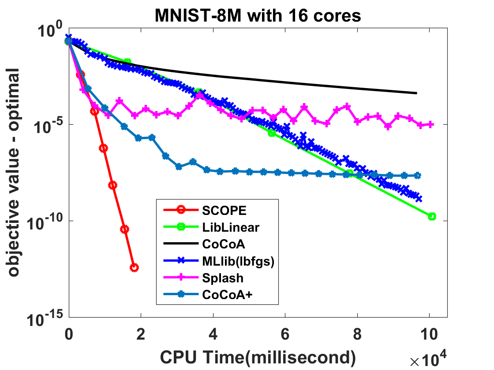
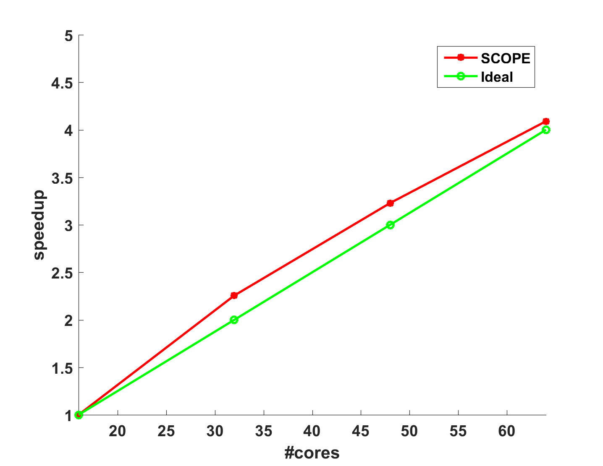
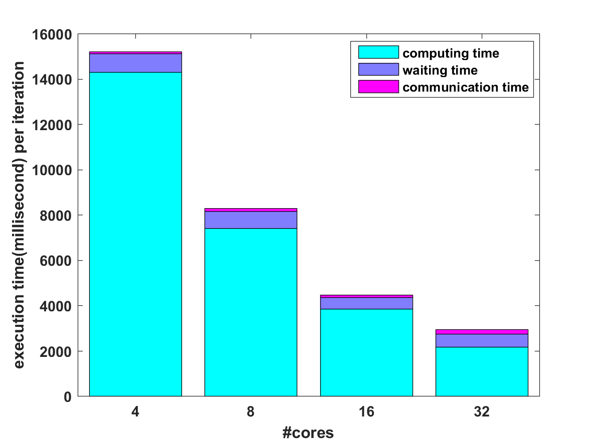

### [Introduction](#introduction)

LIBBLE is the abbreviation for “a LIBrary for Big LEarning”, which provides a toolbox for big data machine learning and data science. We are planning to implement LIBBLE on different distributed platforms, and the version implemented on [Spark](http://spark.apache.org/) is called [LIBBLE-Spark](/LIBBLE-Spark).

LIBBLE is developed by a team under the supervision of [Dr. Wu-Jun Li](http://cs.nju.edu.cn/lwj/), an Associate Professor at Nanjing University.

### [Empirical Comparison](#empirical-comparison)

The main Learning Engine for LIBBLE is based on a distributed stochastic optimization algorithm called [SCOPE (Scalable Composite OPtimization for lEarning)](http://arxiv.org/abs/1602.00133). SCOPE is both computation-efficient and communication-efficient. Theoretical analysis shows that SCOPE is convergent with linear convergence rate when the objective function is strongly convex. Furthermore, empirical results on real datasets show that SCOPE can outperform other state-of-the-art distributed learning methods on Spark, including both batch learning methods and stochastic learning methods.

* Efficiency

  To compare efficiency with state-of-the-art machine learning methods on Spark, we choose logistic regression (LR) with a L2-norm regularization term to evaluate SCOPE and other baselines. The result on MNIST-8M dataset is shown below. We can find that SCOPE outperforms all the other baselines.

  

  

  

* Speedup

  The speedup is defined as follows: $speedup=\frac{(time~with~16~cores)}{(time~with~2x~cores)}$ . And we choose $x=8,16,24,32$. The speedup result is shown below, where we can find that SCOPE has a super-linear speedup, which might be reasonable due to the higher cache hit ratio with more machines. The good speedup of SCOPE can be explained by the fact that most training work can be locally completed by each Worker and SCOPE does not need much communication cost.

  

  

  

* Synchronization Cost

  The following figure shows the synchronization cost, which contains both communication time and waiting time. The synchronization cost of SCOPE is low because most computation is completed locally and only a small number of synchronization times is needed.

  

  ​

  

  

### [About us](#about-us)

* Director: [Wu-Jun Li](http://cs.nju.edu.cn/lwj/)  

* Developers: [Ru Xiang](http://lamda.nju.edu.cn/xiangr), [Peng Gao](http://lamda.nju.edu.cn/gaop), [Ying-Hao Shi](http://lamda.nju.edu.cn/shiyh)

* Theory and Algorithm Designers: [Shen-Yi Zhao](http://lamda.nju.edu.cn/zhaosy), [Wu-Jun Li](http://cs.nju.edu.cn/lwj/)     

  ​

